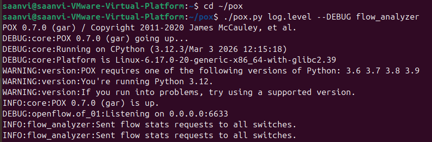
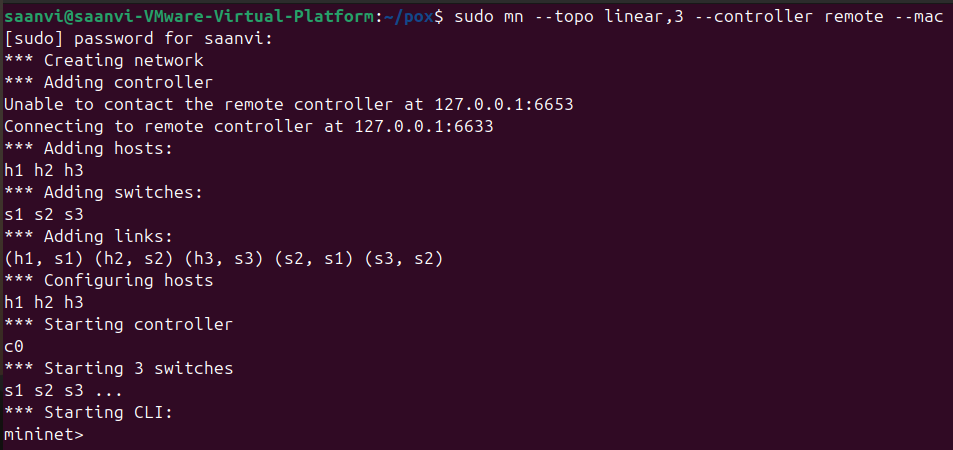
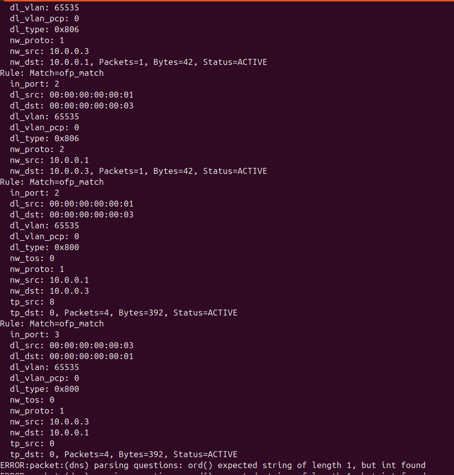
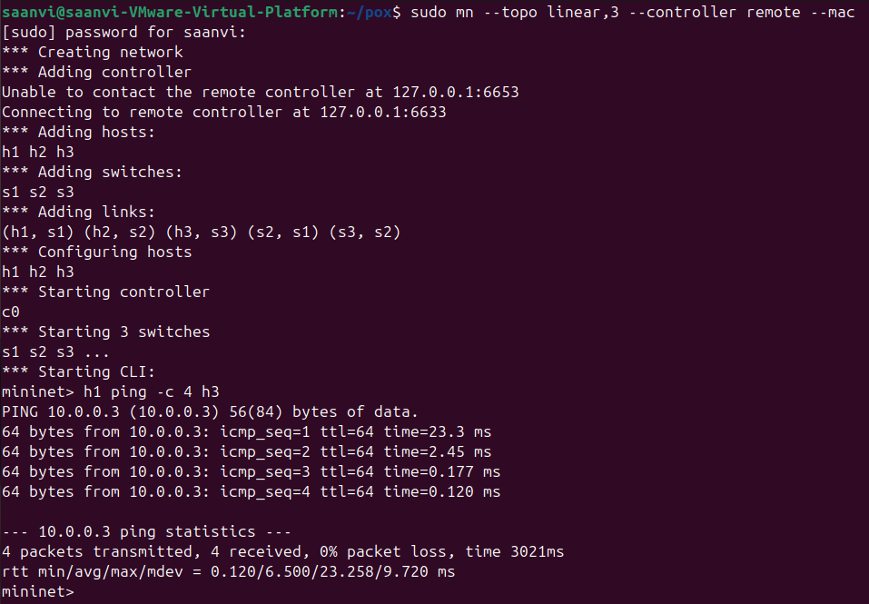
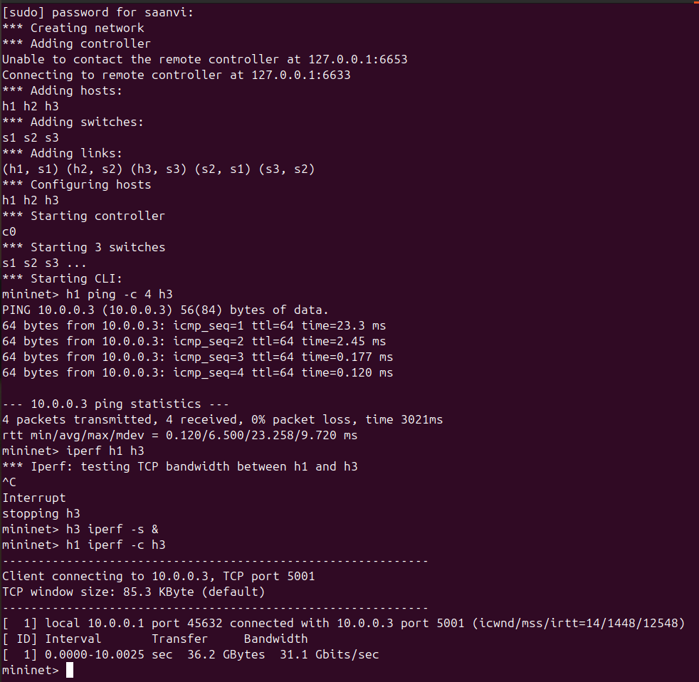
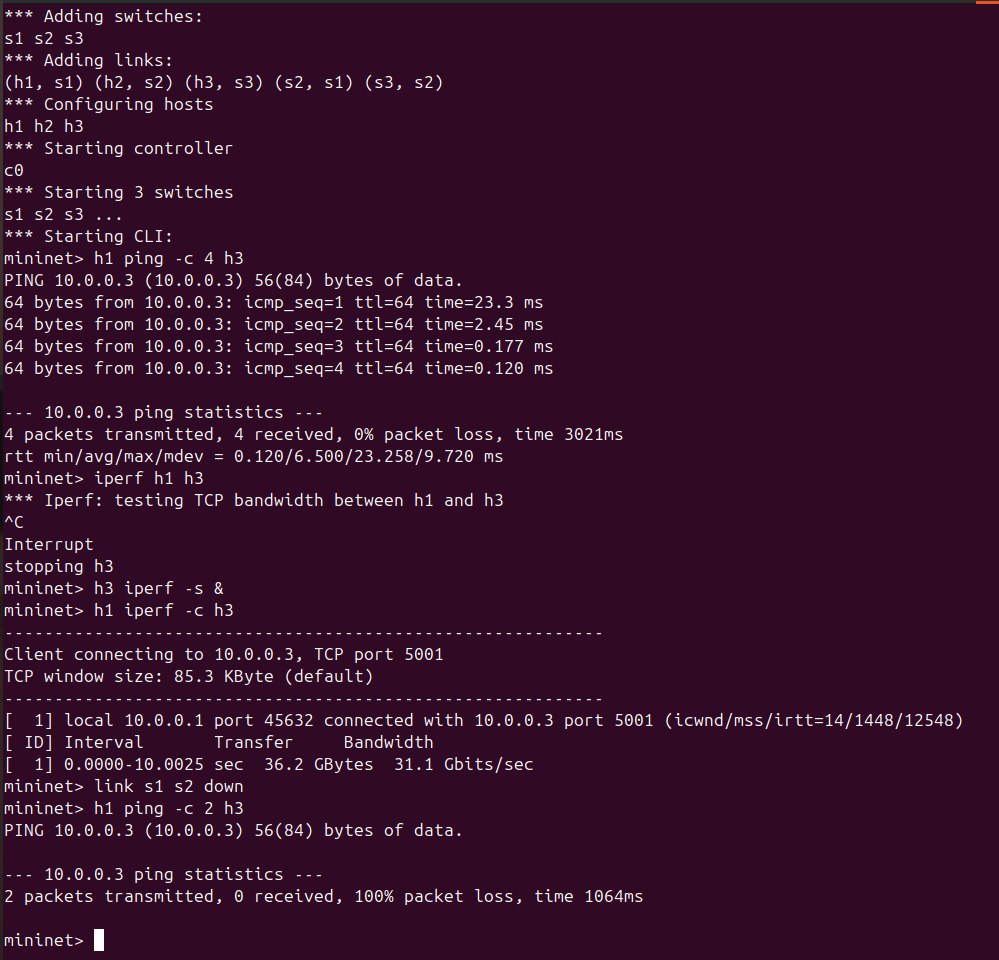
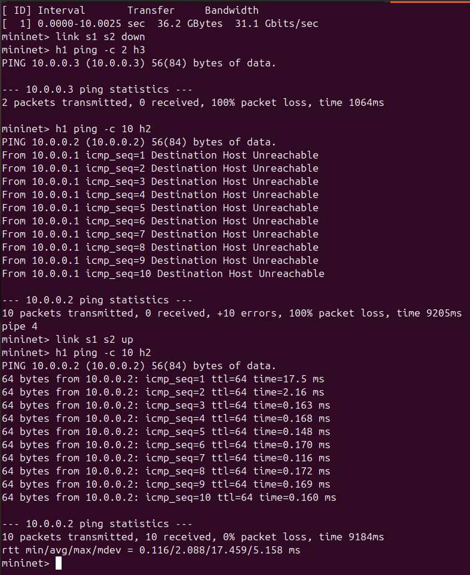
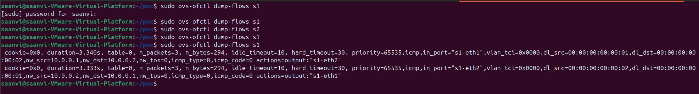
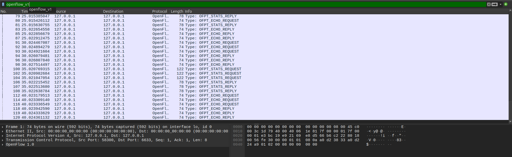
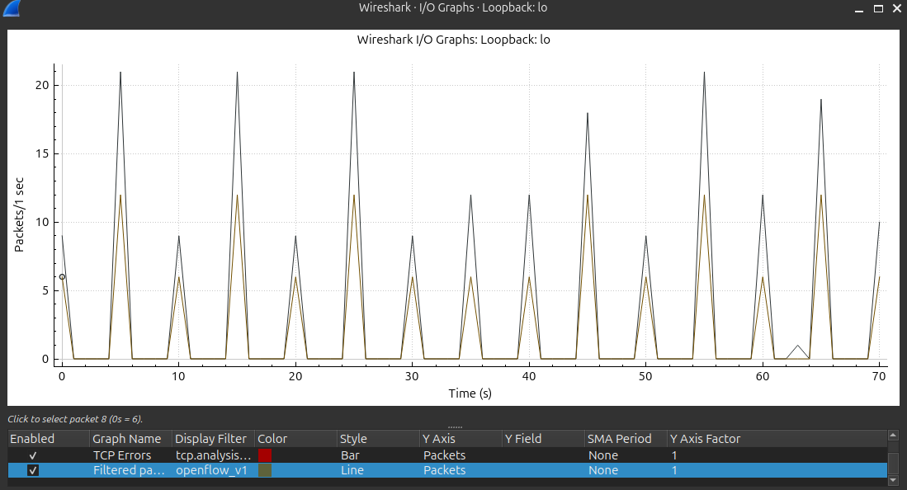

# Multi-Switch Flow Table Analyzer (SDN Project)

## Problem Statement

This project implements an SDN-based monitoring tool using a POX controller and Mininet to analyze flow tables in OpenFlow switches.

It retrieves flow entries, displays rule details, and identifies **ACTIVE vs UNUSED rules** based on packet counts. It also observes network behavior under normal and failure conditions.

---

## Topology

Linear topology with 3 switches and 3 hosts:

```

h1 — s1 — s2 — s3 — h3
|
h2

````

---

## Setup

### Install Requirements

```bash
sudo apt update
sudo apt install mininet
git clone https://github.com/noxrepo/pox.git
````

---

### Run Controller

```bash
cd pox
./pox.py log.level --DEBUG ext.flow_analyzer
```



---

### Run Mininet

```bash
sudo mn --topo linear,3 --controller remote --mac
```



---

## Implementation

* Controller sends flow stats requests every 10 seconds
* Receives flow statistics from switches
* Classifies rules:

  * ACTIVE → packet_count > 0
  * UNUSED → packet_count = 0



---

## Test Scenarios

### 1. Normal Connectivity

```bash
pingall
```

* All hosts reachable
* Flow rules become ACTIVE



---

### 2. Throughput Test

```bash
iperf
```

* Measures bandwidth between hosts



---

### 3. Link Failure

```bash
link s1 s2 down
```

* Packet loss observed



---

### 4. Recovery

```bash
link s1 s2 up
```

* Connectivity restored



---

## Flow Table Verification

```bash
sudo ovs-ofctl dump-flows s1
```



---

## Performance Observation

### Latency (Ping)

* Low latency during normal operation


---

### Throughput (iperf)

* High bandwidth observed


---

### Wireshark Analysis

* Observed OpenFlow messages:

  * STATS_REQUEST
  * STATS_REPLY



---

### Traffic Graph



---

## Key Points

* ACTIVE flows represent real traffic
* UNUSED flows indicate idle rules
* Flow tables update dynamically
* Controller monitors switch behavior in real time

---

## References

* Mininet Documentation
* POX Controller Documentation
* OpenFlow Specification
* Course Guidelines

---

## Conclusion

This project demonstrates real-time SDN monitoring using flow table analysis. It shows how a controller can be extended beyond forwarding to provide visibility into network behavior, including failure and recovery scenarios.


